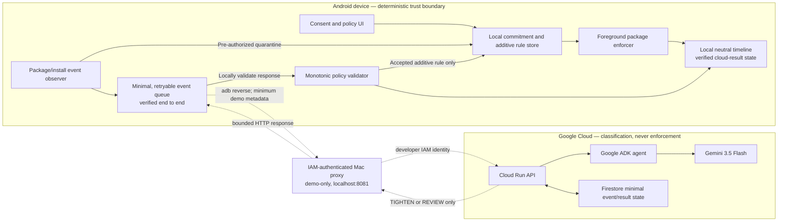

# Architecture and Safety Boundary

This is the working submission-diagram source. The integrated Android-to-cloud ratchet is verified; Cloud remains outside the enforcement trust boundary.



The dashed Mac-proxy path is a controlled hackathon bridge, not production mobile authentication. It can carry a request and a bounded proposal; it has no authority to write the local store, change a commitment, or call the enforcer. The enforcer reads only locally validated rules.

The complete path passed twice from clean commitments: local quarantine preceded upload; a bounded `TIGHTEN` proposal was validated and applied atomically; transient raw metadata was scrubbed; and LuckyMirror remained blocked with the emulator offline. A visible `UNLOCK` fixture was rejected locally with `ACTION_NOT_ALLOWED` and the commitment end unchanged.

## Non-Negotiable Trust Split

### Android may

- create and persist commitments;
- quarantine under a policy the user selected before activation;
- block packages from local rules;
- validate proposals;
- reject any weakening operation;
- continue enforcing offline.

### Cloud agent may

- classify the bounded demo metadata;
- return `TIGHTEN` or `REVIEW`;
- attach confidence and a short user-facing reason;
- store minimal idempotent proof.

### Cloud agent may not

- write the local rule database directly;
- issue `ALLOW`, `UNLOCK`, `DELETE`, `DISABLE`, or earlier expiry;
- change permissions, accessibility settings, VPN settings, or commitment time;
- contact an accountability person;
- request screen text, keystrokes, contacts, messages, financial data, or full app inventory.

## Proposal Contract

Illustrative response shape:

```json
{
  "schema_version": 1,
  "event_id": "opaque-id",
  "commitment_id": "opaque-id",
  "action": "TIGHTEN",
  "target_type": "PACKAGE",
  "target_value": "com.example.luckymirror.demo",
  "classification": "DEMO_GAMBLING_APP",
  "confidence": 0.98,
  "reason": "The package metadata identifies the harmless betting-demo fixture."
}
```

The validator must treat any missing field, unknown enum, mismatched event/commitment, expired commitment, target outside the quarantined event, or weakening semantic as `REVIEW` with no policy change.

## Failure Behavior

| Failure | Safe behavior |
| --- | --- |
| No network | Keep quarantine; queue event |
| Cloud timeout | Keep quarantine; retry idempotently |
| Duplicate response | Ignore after first terminal result |
| Malformed model output | Record `REVIEW`; keep quarantine |
| Weakening proposal | Reject and record safety event |
| Late response after expiry | Do not reactivate or extend the expired commitment |
| Permission revoked | Show `Action required`; do not claim protection |
| Firestore unavailable | Return retryable status; local enforcement unchanged |

## Consumer and Managed Modes

The diagram shows consumer mode. Strong managed-device mode would replace the foreground enforcer with device-owner policy APIs and may enforce package suspension, uninstall blocking, and always-on VPN. That requires provisioning and separate governance; it is not a hidden capability of the consumer APK.

## Secret and Cost Boundary

- No Gemini, service-account, or Firestore administrative credential in the APK.
- Cloud Run owns model and database credentials through workload identity/service account configuration.
- Limit instances, set budget alerts, and turn the service off after capturing required proof.
- Do not log raw request bodies.
