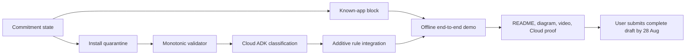

# Deadline-Driven Delivery Sequence

Official deadline: **1 September 2026 at 10:00 AM Melbourne time**. Internal target: **submit a complete draft by 28 August** so Devpost may perform a baseline eligibility check and video processing does not become a deadline risk.

Assumption: one primary Codex-assisted build lane over three to four calendar days, with roughly six to ten human hands-on hours. Downloads, builds, emulator runs, cloud provisioning, and video processing add elapsed time. If capacity is lower, cut P1 and P2 before compressing safety or submission work.

## Milestones

| Melbourne date | Outcome | Exit gate | Cut if behind |
| --- | --- | --- | --- |
| Thu 20 Aug | Product scope, safety boundary, live-rule audit, architecture source | Documents agree on one demo | No extra product discovery |
| Fri 21 Aug | Android skeleton, demo packages, commitment state, targeted package visibility | Clean build; commitment persists | Decorative UI |
| Sat 22 Aug | Known-app local block spike | 10/10 launches blocked on reference emulator | All P1/P2; narrow API/device support |
| Sun 23 Aug | Install quarantine plus monotonic validator | Quarantine precedes cloud; weakening tests pass | Site blocking, Pub/Sub, accountability UI |
| Mon 24 Aug | Cloud Run ADK/Gemini endpoint and Firestore | Real event/result visible; no secrets | Extra models and hosted status page |
| Tue 25 Aug | Android-cloud integration and offline second block | Complete ratchet demo twice | Any feature not in demo |
| Wed 26 Aug | Safety, failure, idempotency, privacy tests; first video recording | All release blockers clear; first cut <=4:00 | Animation and nonessential screens |
| Thu 27 Aug | README clean-run test, diagram export, final demo recording, Cloud proof | Stranger can reproduce; public video processing | New code except critical fixes |
| Fri 28 Aug | Complete Devpost draft submitted early by the user | All required fields/assets present | Stop feature work |
| Sat 29 Aug | Review any organizer feedback; fix only eligibility/reproducibility issues | Draft remains complete | Product expansion |
| Sun 30 Aug | Final incognito link check, secret scan, backup artifacts | Repo/video/diagram links open | All optional work |
| Mon 31 Aug | Melbourne evening final lock and confirmation | No material edits after final submission | No overnight deadline plan |
| Tue 1 Sep, 10:00 AM | Official deadline | Submission already complete | Emergency recovery only |

## Daily Operating Cadence

1. Start with the riskiest unproven claim.
2. End with a demoable increment on the reference emulator.
3. Run validator tests after every policy change.
4. Update README and diagram when architecture changes.
5. Record one short proof clip or screenshot daily.
6. Review release blockers before adding backlog work.

## Critical Path

## Scope Cut Order

Cut in this order without reopening debate:

1. Extra visual polish.
2. Accountability preview.
3. Hosted status page.
4. Pub/Sub.
5. Signed proposals.
6. Site blocking/VPN.
7. Additional model integrations.

Do not cut:

- informed consent and limitation copy;
- deterministic local block;
- local quarantine before cloud;
- closed action schema and weakening rejection;
- offline second-launch proof;
- secrets/privacy checks;
- README, diagram, public video, or Cloud proof.

## Submission Readiness Checklist

- [ ] Entrant has personally reviewed and agreed to current official rules and eligibility.
- [x] Project start date is recorded consistently as `08-19-26`; owner advanced the recommended defaults on 26 August 2026.
- [x] Category is Taskmaster in the local submission draft.
- [x] Gemini 3.5 Flash, Google ADK, Cloud Run, and Firestore are named consistently.
- [ ] Repository link works in an incognito session or required private access is granted.
- [x] README includes clean setup, run, test, deploy, emulator, and demo-fixture steps.
- [x] Architecture diagram matches the final implementation and has PNG/PDF/SVG artifacts.
- [ ] Public YouTube/Vimeo video is processed, viewable, and judged content is <=4:00.
- [ ] Video shows real agent action and visible Google Cloud proof.
- [x] Hosted URL is intentionally omitted unless a stable truthful URL exists; it is optional.
- [ ] No secrets, personal recovery data, or real gambling activity appear in code, logs, screenshots, or video.
- [x] Local submission copy replaces the breathing/walking concept with the truthful LoopLock demo.
- [x] The handoff explicitly reserves Devpost submission for the user; no document authorizes autonomous submission.

## Final-Hours Rule

After final submission, do not edit linked repository, video, or submission materials until the organizer permits it. The latest Devpost announcement warns that post-deadline changes can affect eligibility.
