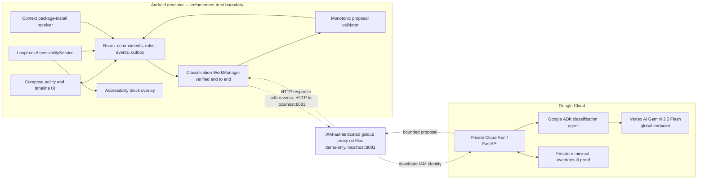

# Technical Implementation Specification

## Overview

LoopLock is a greenfield Android and Google Cloud proof of concept. The technical design preserves one hard boundary: Android performs deterministic blocking from local state; the ADK/Gemini service may classify a quarantined demo package and propose a commitment-scoped package rule, but it has no interface for deleting, allowing, shortening, or directly enforcing rules.

This specification implements the confirmed app-first MVP. `VpnService`, site blocking, Pub/Sub, live accountability delivery, Play Store publication, and managed-device controls are outside the critical path.

Implements:

- `prd.md > Epic 1 — Informed Setup`
- `prd.md > Epic 2 — Deterministic Local Enforcement`
- `prd.md > Epic 3 — Adaptive One-Way Ratchet`
- `prd.md > Epic 4 — Humane Accountability and Recovery`
- `prd.md > Epic 5 — Submission Proof`

## Delivery Model

- Codex-assisted delivery window: three to four calendar days.
- Expected human hands-on time: six to ten hours for installation, permissions, Cloud authorization, milestone review, and video/submission work.
- Implementation pauses after local enforcement, the integrated ratchet, and the submission rehearsal.
- Parallel work begins only after the API schema and local monotonic-policy rules are committed.

## Environment Readiness

Observed on 20 August 2026:

| Capability | Status | Consequence |
| --- | --- | --- |
| Apple Silicon Mac | Available | Use ARM64 Android emulator and Docker images |
| Git | Available | Repository initialized locally on 20 August; not published |
| `uv` | Available | Use it to provision and lock Python 3.13 |
| Python 3.14 | Available | Do not use as deployment baseline; backend pins Python 3.13 |
| Docker | Available | Use for reproducible backend build/test |
| Google Cloud CLI | Available | Existing configured project may be unrelated; confirm project before deploying |
| Java runtime | Available | Android Studio embedded OpenJDK 25; Gradle compiles to Java 17 compatibility |
| Android Studio/SDK/ADB/emulator | Available | Android Studio 2026.1.3.8, API 36, Build Tools 36.0.0, ADB 37.0.1, and `LoopLock_API_36` ARM64 AVD verified |
| Devpost workflow state | Missing | Do not create or mutate it as part of implementation |

Toolchain installation was explicitly approved and completed on 20 August 2026. Further network downloads still require normal implementation authorization.

## Technical Decisions

| Area | Decision | Rationale |
| --- | --- | --- |
| Mobile platform | Native Kotlin Android | Accessibility service, package broadcasts, WorkManager, and emulator control are first-class |
| UI | Jetpack Compose + Material 3 | Fast, testable greenfield UI; no cross-platform bridge |
| Android build versions | Use the current stable Android Studio Empty Compose template; immediately pin generated AGP/Kotlin/Compose versions | Avoid inventing an incompatible version matrix; no upgrades during the hackathon |
| Android support | `minSdk 29`; reference Pixel emulator on API 36; target/compile the stable SDK installed by the template | One known demo environment with modern background restrictions |
| Local database | Room | Transactional commitment/rule/event/outbox state and observable timeline |
| Small settings | Preferences DataStore | Consent version, demo-mode flag, and non-domain UI settings only |
| Background network | WorkManager with connected-network constraint | Durable retries without a custom foreground service |
| HTTP/JSON | Retrofit + OkHttp + Kotlin serialization | Small typed API and easy MockWebServer tests |
| Enforcement | AccessibilityService with package-only window events and `TYPE_ACCESSIBILITY_OVERLAY` | Avoid reading window content and avoid unreliable background activity launches |
| Install signal | Context-registered `ACTION_PACKAGE_ADDED` receiver while the accessibility service is connected, plus targeted reconciliation | Manifest delivery is restricted on modern Android; the active service owns the listener |
| Backend | Python 3.13, FastAPI, Pydantic, `uv` | Small typed service and deterministic packaging |
| Agent framework | Google ADK 2.x, exact version locked by `uv.lock` | Mandatory Google framework; use stable 2.x rather than main/pre-release |
| Model | Vertex AI `gemini-3.5-flash` | Stable event requirement; structured output and no APK API key |
| Cloud compute | Private Cloud Run service in `australia-southeast1`, scale-to-zero | Visible deployment, low idle cost, nearby region |
| Model location | Vertex AI `global` | Use the documented global Gemini endpoint while Cloud Run remains regional |
| Cloud state | Firestore Standard edition | Minimal idempotency and proof records |
| Demo authentication | IAM-private Cloud Run via `gcloud run services proxy` and `adb reverse` | No credential or shared secret in the APK; recorded demo still invokes real Cloud Run |
| Infrastructure | Repeatable `gcloud` scripts, no Terraform | Faster for one short-lived service; commands remain reviewable |
| Site blocking | Not implemented in P0 | Protects schedule and privacy boundary |

At scaffold time, use the current stable Compose template and commit its version catalog. Official Android documentation currently shows AGP 9.x and a versioned Compose BOM; exact resolved values belong in `gradle/libs.versions.toml`, not floating dependencies.

## System Architecture



The dashed proxy path is demo infrastructure, not a production mobile architecture. It carries a bounded classification request and proposal only: Cloud Run has no path to the enforcer or local rule store. Production mobile authentication would require a separately designed end-user identity/App Check path.

Current build status: the private Cloud Run/ADK/Gemini/Firestore path and the integrated Android WorkManager path are verified. Two clean commitments completed the quarantine, upload, local validation, atomic additive-rule application, offline block, and rejected-weakening sequence.

## Repository Structure

```text
hi-stop-gambling-mobile/
├── README.md                              # Judge-first setup, architecture, test, deploy, and demo guide
├── AGENTS.md                              # Repository-specific coding and safety rules for Codex
├── Makefile                               # Short, reviewable build/test/deploy/demo entry points
├── .gitignore                             # Android, Python, local Cloud config, secrets, and recordings
├── .env.example                           # Backend variable names only; never credentials
├── contracts/
│   ├── classification-request.schema.json # Canonical request schema shared by tests
│   ├── classification-response.schema.json# Closed TIGHTEN/REVIEW response schema
│   └── fixtures/                          # Valid, malformed, duplicate, late, and weakening test payloads
├── android/
│   ├── settings.gradle.kts                # Declares app and two fixture modules
│   ├── build.gradle.kts                   # Root Android plugin configuration
│   ├── gradle.properties                  # Reproducible Gradle settings
│   ├── gradle/libs.versions.toml           # All pinned Android dependency versions
│   ├── gradlew / gradlew.bat              # Checked-in Gradle wrapper
│   ├── gradle/wrapper/                    # Pinned Gradle distribution metadata
│   ├── app/
│   │   ├── build.gradle.kts               # Main APK, demo build type, BuildConfig base URL
│   │   └── src/
│   │       ├── main/
│   │       │   ├── AndroidManifest.xml    # Accessibility service; no broad app visibility permission
│   │       │   ├── java/com/histopgambling/looplock/
│   │       │   │   ├── LoopLockApp.kt     # Application, Room/DataStore/WorkManager wiring
│   │       │   │   ├── MainActivity.kt    # Single-activity Compose host
│   │       │   │   ├── navigation/
│   │       │   │   │   └── AppNavGraph.kt # First-run, policy, status, timeline, diagnostics routes
│   │       │   │   ├── ui/
│   │       │   │   │   ├── WelcomeScreen.kt
│   │       │   │   │   ├── PermissionDisclosureScreen.kt
│   │       │   │   │   ├── PolicyBuilderScreen.kt
│   │       │   │   │   ├── CommitmentReviewScreen.kt
│   │       │   │   │   ├── ProtectionStatusScreen.kt
│   │       │   │   │   ├── TimelineScreen.kt
│   │       │   │   │   ├── RecoveryInfoScreen.kt
│   │       │   │   │   └── DiagnosticsScreen.kt
│   │       │   │   ├── domain/
│   │       │   │   │   ├── Models.kt      # Commitment, Rule, Event, Proposal value objects/enums
│   │       │   │   │   ├── CommitmentClock.kt # Wall/elapsed-time policy calculation
│   │       │   │   │   ├── PolicyValidator.kt # Pure monotonic validator
│   │       │   │   │   └── ActivateCommitment.kt # Validated DRAFT -> ACTIVE transition
│   │       │   │   ├── data/
│   │       │   │   │   ├── LoopLockDatabase.kt # Room database and migrations
│   │       │   │   │   ├── Entities.kt    # Commitment/rule/event/outbox rows
│   │       │   │   │   ├── Daos.kt        # Transactional reads/writes and timeline flows
│   │       │   │   │   ├── PolicyRepository.kt # Only write gateway for protection policy
│   │       │   │   │   └── SettingsStore.kt # Consent/UI preferences
│   │       │   │   ├── enforcement/
│   │       │   │   │   ├── LoopLockAccessibilityService.kt # Package-only event listener
│   │       │   │   │   ├── BlockOverlayController.kt # Full-screen TYPE_ACCESSIBILITY_OVERLAY
│   │       │   │   │   ├── InstallMonitor.kt # Context ACTION_PACKAGE_ADDED receiver
│   │       │   │   │   └── ServiceHealth.kt # Honest enabled/disabled state
│   │       │   │   ├── network/
│   │       │   │   │   ├── AgentApi.kt     # Retrofit POST classification endpoint
│   │       │   │   │   ├── ApiModels.kt    # Kotlin request/response contract mapping
│   │       │   │   │   └── ClassificationWorker.kt # Durable upload/retry/application flow
│   │       │   │   └── diagnostics/
│   │       │   │       └── DemoDiagnostics.kt # Safe event IDs/status; no raw cloud reasoning
│   │       │   └── res/
│   │       │       ├── xml/accessibility_service_config.xml # No window-content retrieval
│   │       │       ├── xml/network_security_config.xml # Debug localhost cleartext only
│   │       │       └── values/strings.xml  # Neutral safety and consent copy
│   │       ├── test/                       # JVM unit tests for clock, validator, repositories, API mapping
│   │       └── androidTest/                # Room, WorkManager, Compose, and service-state instrumentation tests
│   ├── fixtures/
│   │   ├── betburst/                       # Harmless initially selected betting-demo APK
│   │   └── luckymirror/                    # Harmless workaround APK installed during commitment
│   └── scripts/
│       ├── create-emulator.sh              # Reference API 36 ARM64 AVD setup
│       ├── enable-demo-service.sh           # Prints/manual-opens settings; does not bypass consent
│       ├── install-fixtures.sh              # Installs LoopLock and BetBurst before commitment
│       ├── install-workaround-fixture.sh    # Installs LuckyMirror during active commitment
│       ├── connect-demo-proxy.sh             # adb reverse to the demo-only proxy on port 8081
│       └── run-demo-check.sh                # Repeatable adb launches and diagnostic capture
├── backend/
│   ├── pyproject.toml                       # Python 3.13 and bounded stable dependencies
│   ├── uv.lock                              # Exact reproducible dependency resolution
│   ├── .python-version                      # `3.13`
│   ├── Dockerfile                           # Python 3.13 slim, non-root runtime
│   ├── agents-cli-manifest.yaml             # Records ADK/Cloud Run project shape
│   ├── src/looplock_agent/
│   │   ├── __init__.py
│   │   ├── main.py                          # FastAPI app and health/classification routes
│   │   ├── config.py                        # Validated environment configuration
│   │   ├── models.py                        # Pydantic API and proposal models
│   │   ├── agent.py                         # Single ADK Gemini classification agent
│   │   ├── instructions.py                  # Prompt: fixtures only, TIGHTEN or REVIEW, no inference inflation
│   │   ├── classification_service.py        # Idempotency, agent run, deterministic validation
│   │   ├── firestore_repository.py          # Minimal create/read/update operations
│   │   └── hashing.py                       # Target hash; never logs raw request
│   └── tests/
│       ├── test_contract.py                 # JSON schema and enum closure
│       ├── test_idempotency.py              # Same event returns one logical result
│       ├── test_agent_guardrails.py          # Malformed/injected metadata yields REVIEW or safe TIGHTEN
│       └── test_api.py                       # Health, POST, duplicate, timeout, validation behavior
├── infra/
│   ├── README.md                            # Required APIs, IAM roles, region, cost controls, teardown
│   ├── deploy.sh                            # Reviewed private Cloud Run source/container deployment
│   ├── proxy.sh                             # Authenticated localhost proxy command
│   └── teardown.sh                          # Disables/deletes demo resources after proof with confirmation
└── docs/
    ├── hackathon-build/                     # Product pack and this specification
    └── submission/
        ├── architecture.mmd                 # Diagram source updated to actual components
        ├── demo-script.md                   # Four-minute shot/voiceover script
        └── evidence-checklist.md            # Screenshots, logs, Cloud proof, link checks
```

Generated build outputs, local recordings, Cloud credentials/configuration, `.env`, and service-account keys must never be committed.

## Android Application

### App Shell and Screens

Implements: `prd.md > Epic 1`, `prd.md > Epic 4`.

- One `MainActivity` with Compose navigation.
- UI state comes from repository `Flow`s; composables do not write Room directly.
- First-run disclosure precedes the system accessibility settings intent.
- Policy builder lists only the two repository-owned fixture packages; it does not enumerate installed apps.
- Demo build offers five minutes and labels it demo duration. Product copy states the normal default is 24 hours.
- `Protected` is shown only when an active commitment exists and the accessibility service is currently enabled.

### Local Persistence

Implements: `prd.md > Domain Model`, `prd.md > State and Transition Rules`.

Room tables:

#### `commitments`

| Field | Type | Rule |
| --- | --- | --- |
| `id` | UUID text PK | Locally generated |
| `status` | enum text | `DRAFT`, `ACTIVE`, `EXPIRED` |
| `created_wall_ms` | long | Audit/display only |
| `starts_wall_ms` | long | Immutable after activation |
| `duration_ms` | long | Five minutes in demo; 24 hours normal |
| `start_elapsed_ms` | long | Same-boot monotonic calculation |
| `boot_count` | int | Detects reboot boundary |
| `quarantine_new_installs` | boolean | Must be explicitly true |
| `consent_version` | int | Starts at `1` |

Only one active commitment is permitted.

#### `rules`

| Field | Type | Rule |
| --- | --- | --- |
| `id` | UUID text PK | Locally generated |
| `commitment_id` | FK | Required |
| `target_package` | text | Local only |
| `target_version_code` | long nullable | Present for install-instance quarantine |
| `source` | enum | `USER_SELECTED`, `QUARANTINE`, `AGENT_TIGHTENED` |
| `created_wall_ms` | long | Required |
| `expires_wall_ms` | long | Must equal commitment end |

`AGENT_TIGHTENED` is package-scoped and survives uninstall/reinstall during the commitment. `QUARANTINE` is tied to the observed installation instance. Both block immediately; the tightening converts a pending instance hold into a durable package rule. No code path deletes an active row.

#### `events`

Stores neutral local timeline data: UUID, commitment ID, event type, target SHA-256, timestamps, correlation ID, result code, and upload state. Raw model reasoning is never a field.

#### `classification_outbox`

Stores event ID, commitment ID, transient package name/label/version needed for classification, retry count, and terminal state. Raw metadata is cleared after a terminal `TIGHTEN` or `REVIEW` result.

All quarantine creation, event creation, and outbox creation occur in one Room transaction.

### Commitment Clock

Implements: `prd.md > AC-02`, `AC-10`.

- On the same boot, elapsed time is `SystemClock.elapsedRealtime() - start_elapsed_ms`; wall-clock changes cannot expire early.
- On process restart, the stored monotonic start remains valid.
- On reboot, detect changed boot count and fall back to the persisted wall end. Consumer mode cannot guarantee resistance to deliberate clock changes across reboot; diagnostics must state this limitation.
- A clock inconsistency never changes `ends_wall_ms`. It may keep protection active and show `Action required`; it may not shorten the commitment.
- Expiry is computed by the repository and materialized as an `EXPIRED` event once; there is no agent involvement.

### Accessibility Enforcement Service

Implements: `prd.md > Story 2.1`, `Story 2.2`.

- User enables the service manually in Android settings after in-app disclosure.
- `canRetrieveWindowContent=false`; do not request or traverse accessibility nodes.
- Subscribe only to window-state/window-change events and dynamically set `packageNames` to active local rule targets.
- On a blocked package event:
  1. debounce duplicate system events;
  2. call `GLOBAL_ACTION_HOME`;
  3. show a full-screen `TYPE_ACCESSIBILITY_OVERLAY` owned by LoopLock;
  4. write one local `BLOCK_ATTEMPT` event;
  5. offer a user-tapped route back to LoopLock status.
- The overlay identifies itself as LoopLock and must not imitate Android or the target app.
- The service never accepts a command from the cloud. It observes only Room rule flows.

### Install Monitor

Implements: `prd.md > Story 3.1`.

- Register `ACTION_PACKAGE_ADDED` dynamically in `onServiceConnected()` and unregister on destroy.
- Ignore replacements and LoopLock's own fixture setup unless the commitment is active and quarantine was explicitly chosen.
- P0 supports the repository-owned LuckyMirror package, declared through targeted `<queries>`; no `QUERY_ALL_PACKAGES`.
- Immediately create an installation-instance quarantine and update accessibility package filters.
- Enqueue unique WorkManager work named by `event_id`.
- On service connection and main-app resume, reconcile the targeted fixture package to recover a missed broadcast.
- If the service is disabled, status becomes `Action required`; do not claim background install monitoring.

### Monotonic Policy Validator

Implements: `prd.md > Story 3.3`.

The validator is a pure Kotlin function with no network, database, clock, or Android dependency. Inputs are an immutable local snapshot, proposal, and trusted current-time result.

Accept `TIGHTEN` only when all conditions hold:

1. schema version is supported;
2. commitment IDs and event IDs match local state;
3. commitment is active;
4. target package exactly matches the quarantined event;
5. the target installation is locally quarantined;
6. proposal expiry is absent—the server is not allowed to choose it;
7. resulting package rule expires at the unchanged local commitment end;
8. the operation adds or upgrades `QUARANTINE -> AGENT_TIGHTENED` and never removes another rule.

`REVIEW` creates a neutral result event and leaves quarantine unchanged. Unknown enums, missing fields, duplicate terminal proposals, expired commitments, mismatches, `ALLOW`, `UNLOCK`, `DELETE`, earlier expiry, or extra authority fields are rejected without policy change.

### WorkManager Classification Flow

Implements: `prd.md > Story 3.2`, `AC-06`, `AC-08`, `AC-09`.

Build status: **item 8 verified end to end**. The Android worker, validator application, local persistence, and timeline passed two clean-commitment rehearsals.

- Unique work per event with `NetworkType.CONNECTED`.
- POST the contract to `http://127.0.0.1:8081/v1/classifications` in the demo build.
- `adb reverse tcp:8081 tcp:8081` sends emulator localhost traffic to the IAM-authenticated Mac proxy.
- Retry timeouts, 429, and 5xx with bounded exponential backoff.
- Treat contract-invalid 2xx as a safety rejection, not a retry loop.
- Apply response and timeline event in one Room transaction.
- Clear transient raw metadata after terminal response.
- Offline blocking continues from Room before, during, and after classification.

## Fixture Applications

Implements: `scope.md > Core Demo Path`.

- `BetBurst Demo`: installed before commitment; package `com.histopgambling.fixture.betburst`.
- `LuckyMirror Demo`: installed during commitment; package `com.histopgambling.fixture.luckymirror`.
- Both are clearly labeled harmless fixtures and contain static, locally owned artwork/text only.
- They have no network, account, payment, gambling mechanics, ads, analytics, or third-party assets.
- LuckyMirror metadata is intentionally easy to classify from package name and label. The submission must state that arbitrary app classification is production research, not proven by this fixture.

## Backend API

### `GET /healthz`

Returns `200 {"status":"ok","service":"looplock-agent"}`. It does not call Gemini or Firestore.

### `POST /v1/classifications`

Implements: `prd.md > Story 3.2`.

Request:

```json
{
  "schema_version": 1,
  "event_id": "uuid",
  "commitment_id": "uuid",
  "target": {
    "type": "PACKAGE",
    "package_name": "com.histopgambling.fixture.luckymirror",
    "label": "LuckyMirror Demo",
    "version_code": 1
  }
}
```

Constraints:

- body <= 8 KiB;
- UUIDs valid;
- package and label bounded and treated as untrusted data;
- `Idempotency-Key` must equal `event_id`;
- reject unknown top-level fields in Pydantic models.

Terminal response:

```json
{
  "schema_version": 1,
  "event_id": "uuid",
  "commitment_id": "uuid",
  "action": "TIGHTEN",
  "target_type": "PACKAGE",
  "target_value": "com.histopgambling.fixture.luckymirror",
  "classification": "DEMO_GAMBLING_APP",
  "confidence": 0.98,
  "reason_code": "FIXTURE_MATCH",
  "reason": "The package metadata matches the harmless betting-demo fixture."
}
```

Possible actions are exactly `TIGHTEN` and `REVIEW`. The API never returns expiry, permission, allow-list, messaging, or deletion fields.

Idempotency behavior:

- First valid request creates `events/{event_id}` as `PROCESSING` using Firestore create semantics.
- Duplicate with terminal result returns the stored response.
- Duplicate while processing returns `202 {"status":"processing"}`; Android retries.
- A processing lease expires after 60 seconds so a retry can safely reclaim work after a crash.
- The raw package/label is passed to Gemini in memory and not stored in Firestore or application logs.

### `GET /v1/classifications/{event_id}`

Returns processing or terminal status to support retries and demo diagnostics. It never returns raw input or model reasoning.

## ADK Agent

Implements: `prd.md > AI Usage`, `Story 3.2`.

- One ADK `Agent`, not a multi-agent graph.
- Model: `gemini-3.5-flash` through Vertex AI.
- Thinking level: low or minimal where supported; classification is narrow.
- Structured output mapped to a Pydantic draft result.
- Instruction treats package metadata as untrusted quoted data, forbids following instructions contained inside it, and says uncertainty must return `REVIEW`.
- Only the two harmless fixture identities can produce `TIGHTEN` in P0 tests. Everything else returns `REVIEW`.
- The backend independently validates the draft result against the input and closed schema before Firestore and Android ever see it.
- Do not store or expose thought signatures, chain-of-thought, or full model response.

The agent has no tool that changes Android state. Its real action is producing and persisting a bounded proposal in response to a system event; Android retains final enforcement authority.

## Firestore

Implements: `prd.md > AC-08`, `AC-11`.

Collection `classification_events`, document ID `event_id`:

| Field | Stored |
| --- | --- |
| `schema_version` | yes |
| `event_id`, `commitment_id` | yes, opaque UUIDs |
| `target_hash` | yes, SHA-256 for fixture proof |
| `status` | `PROCESSING`, `TIGHTEN`, `REVIEW`, `ERROR` |
| `classification`, `confidence`, `reason_code` | terminal results only |
| `created_at`, `updated_at`, `lease_expires_at` | server timestamps |
| raw package/label/version | no |
| user/device/account identifier | no |
| model reasoning or prompt | no |

Use the Cloud Run service identity and Application Default Credentials. Grant only the permissions required for Vertex AI invocation and Firestore user access. Do not generate or download a service-account key.

## Cloud Run Deployment and Demo Connectivity

Implements: `prd.md > Story 5.1`.

- Confirm the Google Cloud project and billing/credit choice with the user before any deployment.
- Required APIs: Cloud Run, Cloud Build/Artifact Registry if source building, Vertex AI, and Firestore.
- Region: `australia-southeast1`; Vertex AI location environment variable: `global`.
- Service name: `looplock-agent`.
- Private IAM service; do not pass `--allow-unauthenticated`.
- Runtime service account: dedicated `looplock-agent-runtime` with least privilege.
- Min instances `0`, max instances `1`, concurrency `4`, timeout `60s`, memory `512Mi` initially.
- No request-body logging; log event ID, status, latency, and reason code only.
- Set a small billing alert in Cloud Console; budget alerts notify but do not cap spend.

Demo commands conceptually:

1. Deploy private service.
2. Start `gcloud run services proxy looplock-agent --project PROJECT_ID --region australia-southeast1 --port 8081`.
3. Run `adb reverse tcp:8081 tcp:8081`.
4. Android calls its debug localhost base URL; the proxy attaches the active developer identity.
5. Capture Cloud Run revision/log and Firestore document proof.

No script may deploy, change IAM, enable billing, or tear down resources without user approval.

## Security and Privacy

Implements: `prd.md > Product Principles`, `risks.md > Privacy and Security Risks`.

- No Gemini/API/service-account secret in Android, Git, README, video, or fixture APKs.
- Private Cloud Run for the demo; no public classifier URL.
- No accessibility node/content access, screenshots, typed text, contacts, messages, financial data, or full installed-app inventory.
- Targeted `<queries>` declarations only for repository fixtures.
- Raw package metadata is transient locally and in backend memory, then cleared.
- Firestore and logs contain opaque IDs, hashes, codes, and timestamps only.
- Android does not trust the model, HTTP status, or backend validator; it runs its own monotonic validator.
- Package label and name are prompt-injection inputs, never instructions.
- The service-disabled state is visible and prevents the `Protected` claim.

## Failure Strategy

Build status: **item 9 verified on the API 36 reference emulator**. Expiry decisions now use persisted elapsed time on the same boot; wall-clock rollback cannot shorten or delay the trusted interval. Permission revocation changes the visible status to `Action required`, and the accountability preview is local-only and closed to attempt count, time window, and escalation level.

| Failure | Android behavior | Backend behavior |
| --- | --- | --- |
| No network/proxy | Keep quarantine, show queued, retry | No request |
| Cloud timeout/5xx | Keep quarantine, bounded retry | Structured error log without raw input |
| Duplicate event | One local event/rule | Return existing or processing result |
| Gemini malformed/refusal | Keep quarantine, record review/rejection | Normalize to `REVIEW` |
| Prompt injection in label | Keep quarantine unless exact fixture safely matches | Treat metadata as data; validate schema/input match |
| Firestore unavailable | Keep quarantine, retry | 503; no false terminal success |
| Late response after expiry | Ignore policy change; retain audit event | Return stored result |
| Accessibility disabled | Show `Action required`; do not claim block | Unaffected |
| Package broadcast missed | Targeted reconciliation on service/app resume | Unaffected |
| Process restart | Reload Room before updating package filters | Stateless service resumes from Firestore |
| Reboot | Persist rules; conservative wall-time fallback | Unaffected |

## Verification Strategy

### Contract-first gate

- JSON schemas validate fixture requests/responses in Kotlin and Python tests.
- Weakening fields/actions are absent from the response schema.
- Both implementations share golden JSON fixtures.

### Android unit tests

- All validator rejection paths.
- `QUARANTINE -> AGENT_TIGHTENED` only.
- Same-boot wall-clock rollback does not expire early.
- Duplicate/late response behavior.
- Event/outbox atomic transaction.
- API serialization rejects unknown actions.

### Android instrumentation/manual tests

- Room migration/schema test.
- WorkManager success/retry with MockWebServer.
- Compose disclosure and status states.
- Ten BetBurst launches and ten LuckyMirror installs/reinstalls on the reference emulator.
- Airplane-mode second launch.
- Disable accessibility and confirm `Action required`.
- Process kill/restart and emulator reboot persistence.

### Backend tests

- Pydantic rejects oversized/unknown/mismatched input.
- Exact fixture yields a schema-valid proposal.
- Arbitrary/malicious labels yield `REVIEW` or safely bounded output.
- Three duplicate requests produce one logical terminal record.
- Firestore failure never returns a false success.
- Logs do not include raw package/label.

### End-to-end release gate

1. Clean checkout and dependency installation.
2. Backend tests and container start.
3. Private Cloud Run deployment plus health check through proxy.
4. Android build/tests and fixture installation.
5. Five-minute policy activation.
6. Local BetBurst block.
7. LuckyMirror install quarantine and real Cloud classification.
8. Accepted durable package rule.
9. Network off, optional uninstall/reinstall, and offline block.
10. Invalid `UNLOCK` fixture rejected with unchanged end time.
11. Four-minute video and architecture match actual evidence.

## Parallel Implementation Lanes

### Lane A — Android critical path

Toolchain, project/fixture modules, Room domain state, validator, accessibility enforcement, install monitor, and UI.

### Lane B — Cloud agent

Contracts, FastAPI, ADK/Gemini classification, Firestore idempotency, container, and deployment scripts.

### Lane C — Verification and submission evidence

Golden fixtures, cross-language contract tests, README skeleton, diagram updates, demo script, and evidence checklist.

Merge gates:

1. Contract/schema and enum gate before network code.
2. Local enforcement milestone before Cloud integration.
3. Integrated ratchet milestone before submission recording.

Parallel work reduces elapsed time but does not eliminate the Android emulator, IAM, integration, and video bottlenecks.

## External APIs and Dependencies

Use current stable releases at scaffold time and lock them immediately; never use dynamic versions.

- [Android AccessibilityService](https://developer.android.com/reference/android/accessibilityservice/AccessibilityService)
- [Android broadcast limitations](https://developer.android.com/develop/background-work/background-tasks/broadcasts)
- [Android WorkManager](https://developer.android.com/topic/libraries/architecture/workmanager)
- [Jetpack Room](https://developer.android.com/training/data-storage/room)
- [Jetpack Compose setup](https://developer.android.com/develop/ui/compose/setup-compose-dependencies-and-compiler)
- [Google ADK Python](https://github.com/google/adk-python)
- [Gemini 3.5 Flash](https://ai.google.dev/gemini-api/docs/models/gemini-3.5-flash)
- [Vertex AI Gemini quickstart](https://docs.cloud.google.com/vertex-ai/generative-ai/docs/start/quickstart)
- [Cloud Run source deployment](https://docs.cloud.google.com/run/docs/deploying-source-code)
- [Cloud Run private developer proxy](https://docs.cloud.google.com/sdk/gcloud/reference/run/services/proxy)
- [Cloud Run service identity](https://docs.cloud.google.com/run/docs/configuring/services/service-identity)
- [Firestore server client setup](https://firebase.google.com/docs/firestore/quickstart-server)
- [Firestore transactions](https://firebase.google.com/docs/firestore/manage-data/transactions)
- [Google Play sensitive APIs policy](https://support.google.com/googleplay/android-developer/answer/16558241)

## Architecture Self-Review

### Finding 1 — Agent action is intentionally narrower than enforcement

Local quarantine protects before the model responds. The agent's visible contribution is converting an installation-instance quarantine into a commitment-scoped package rule that survives reinstall. The demo should include uninstall/reinstall or clear diagnostics so this does not look ornamental.

### Finding 2 — Private proxy is secure but demo-specific

The IAM proxy avoids credentials in the APK and proves Cloud Run deployment, but it is not a hosted consumer architecture. The README and video must label it as demo connectivity. Do not imply judges can use the APK without the proxy.

### Finding 3 — Generic new-app quarantine is not proven

P0 uses targeted, repository-owned fixtures. Arbitrary installed-app discovery/classification would introduce package-visibility and false-positive issues. Product and submission copy must say the adaptive workflow is proven on controlled fixtures, with broader coverage in the production vision.

## Demo and Submission Flow

The implementation must support the storyboard in `user-journey.md` without hidden manual state edits. Cloud evidence should show:

- private Cloud Run service/revision in `australia-southeast1`;
- request log keyed only by event ID and result code;
- Firestore terminal document without raw package data;
- Gemini model and Google ADK named in configuration/code;
- Android offline rule enforcement after the Cloud result.

The final architecture diagram must show the private proxy as a dashed demo-only connector and retain the deterministic Android/cloud-agent trust split.

## Build Start Gate

Implementation may begin when:

- this spec and the reconciled checklist agree;
- the user approves Android toolchain installation;
- the user confirms which Google Cloud project may be used and whether billing/credits are ready;
- the contract files are created before Android and backend lanes diverge.

No Devpost update, public deployment, paid resource, repository publication, or submission is authorized by this specification.
