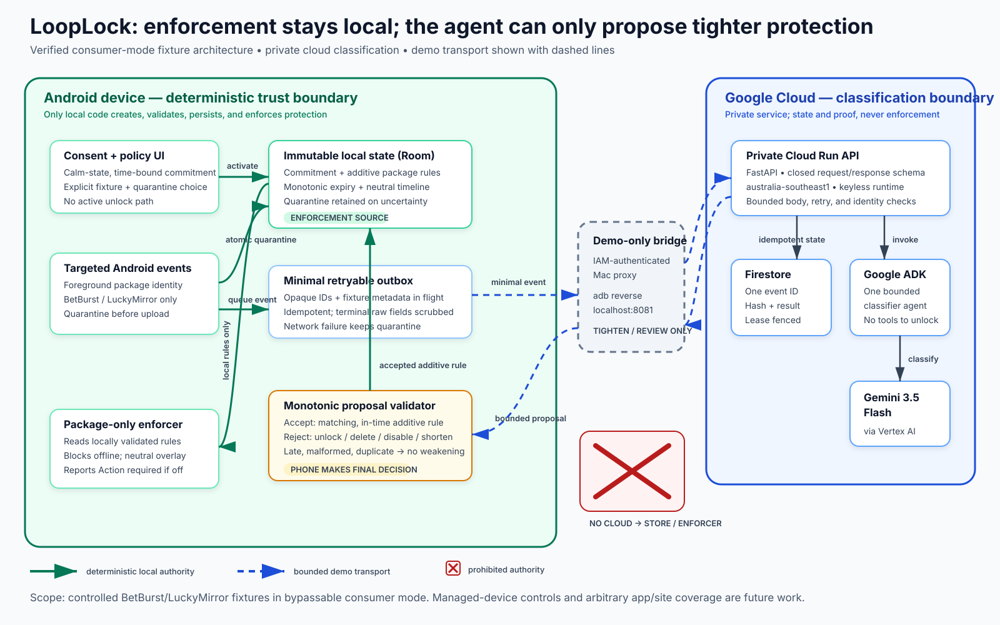

# LoopLock Architecture — Deterministic Enforcement, Bounded Agent

The diagram's primary question is: **who has authority to change protection?** The answer is the Android trust boundary. Cloud services classify and preserve minimal proof; they cannot enforce, unlock, or write local state.

Upload artifacts:

- `architecture.png` — 1600 × 1000 raster export for the Devpost file field.
- `architecture.pdf` — vector-source print export fallback.
- `architecture.svg` — accessible source of truth with embedded title and description.

## Reading order

1. The user creates an immutable commitment through the consent and policy UI.
2. A targeted package/install event produces local quarantine and a minimal retryable outbox event atomically.
3. The local rule store alone feeds the accessibility-based package enforcer.
4. The outbox crosses a dashed, demo-only `adb reverse`/IAM proxy path to private Cloud Run.
5. Cloud Run persists idempotent minimal state in Firestore and invokes one bounded Google ADK agent using Gemini 3.5 Flash.
6. The response is limited to `TIGHTEN` or `REVIEW` and returns through the proxy.
7. The phone's monotonic validator accepts only an additive, matching, in-time rule. Rejection retains quarantine.
8. No cloud component, proxy, or model has a path to the local store or enforcer.

Solid green arrows are deterministic local authority. Dashed blue arrows are bounded demo transport. The red barred annotation marks a prohibited authority path; color is redundant with line style and text for accessibility.

## Scope caveat

This is the verified consumer-mode fixture architecture. It does not claim arbitrary package discovery, site blocking, uninstall prevention, a public mobile-authentication design, or managed-device control. Strong mode is separate future work using device-owner provisioning and governance.
